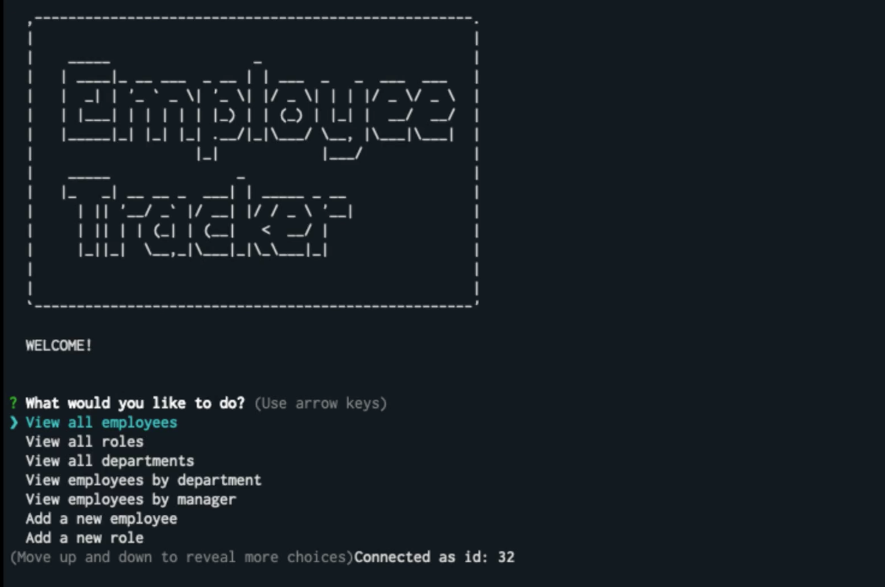
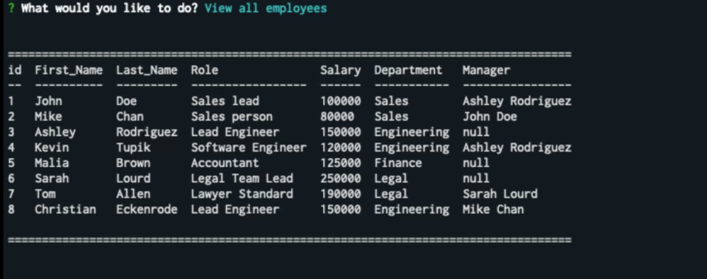
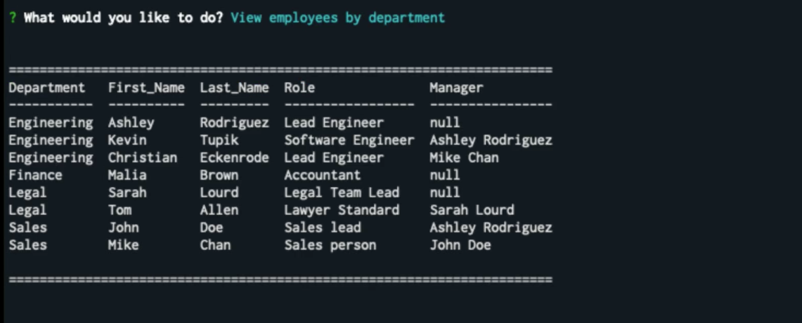
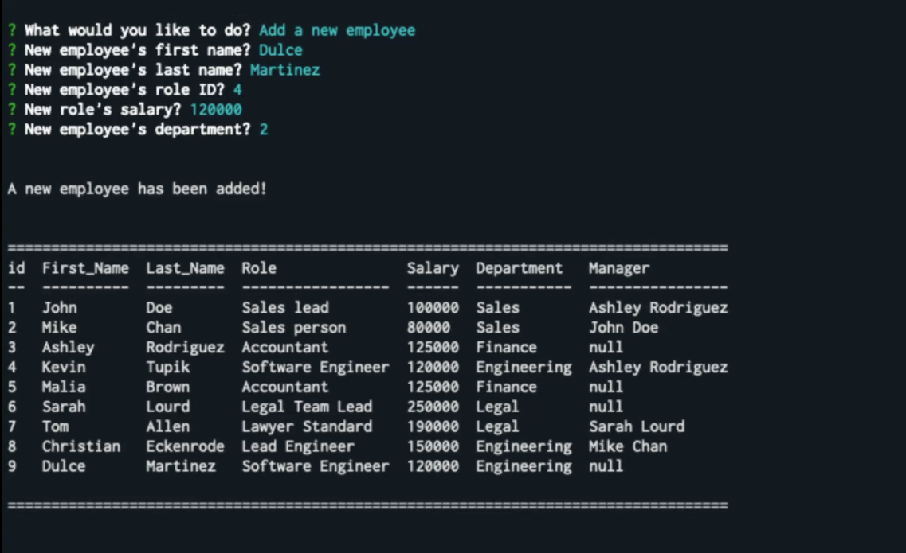

# Employee Tracker CLI

  ## Description
  This **Content Management System** application will allow a company's Human Resources department to interact with the information stored in their employees database. It is a command-line application that allows to view, add and update employees information.

  A business owner would be able to organize and plan the company's productivity by managing departments, roles, managers, and staff.

  The **Employee Tracker** has been created with **MySQL Workbench**, **JavaScript**, **Node.js**, and **ES6+**, the following **NPM** packages: [**MySQL**](https://www.npmjs.com/package/mysql), [**Inquirer**](https://www.npmjs.com/package/inquirer), [**Console Table**](https://www.npmjs.com/package/console.table) and [**Asciiart Logo**](https://www.npmjs.com/package/asciiart-logo) as dependencies. The deployed interface will look like this:


  


  ## Table of Contents
  - [Installation](#installation)
  - [Usage](#usage)
  - [License](#license)
  - [Contributing](#contributing)
  - [Questions](#questions)

  ## Installation
  To run the **Employee Tracker** you will need to install: The provided **package.json** containing the required dependencies.

  ## Usage
  How this application can be used: Input **node** **server.js** to start the app.
  The following **walk-through demo** shows the app functionality:

  

  When the application starts it displays a menu of actions, the arrow keys will allow the user to navigate through the options.
  
  The application will display different tables from the database and / or will prompt questions depending on the user's request. See the following examples:

  

  

  

  


  The following video demonstrates the entirety of the app's functionality:

  [**Employee Tracker Video Demo**](https://drive.google.com/file/d/1vid9n95dMtscy6Ci68qrypoSDDno5SBF/view?usp=sharing)


  - - -

  ## License
    MIT

  ## Contributing
    Jon Phoenix


- - -

  ## Questions
  
 
  
 
  
 Application repository: https://github.com/JonPhoenix/employee-tracker
  
 For further questions, please contact the author at: jonphx@uw.edu

- - -

  ## References
  ```
  * w3schools.com
  * developer.mozilla.org
  * mysql.com

  * nodejs.org
  * node.readthedocs.io
  * npmjs.com

  * screencastify.com

  ```
  - - -

